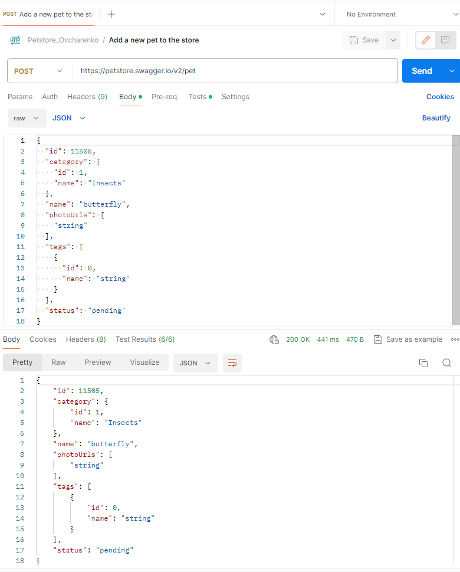

# Tech_QA_Petstore

This repository shows QA test work with the https://petstore.swagger.io/v2/swagger.json API using Swagger, Postman

## For example the POST method:

## Automated JSON validation for every request

And other methods.

The methods are used from the section "Everything about your Pets".

- 1 query for each of the functionalities with a 4XX code has been added.
- Automated checks of 2XX and 4XX response codes for each request.
- Automated JSON validation for each query with a body in the response (except for the Find pets by status query).
- The exported collection has been added to the repository.
